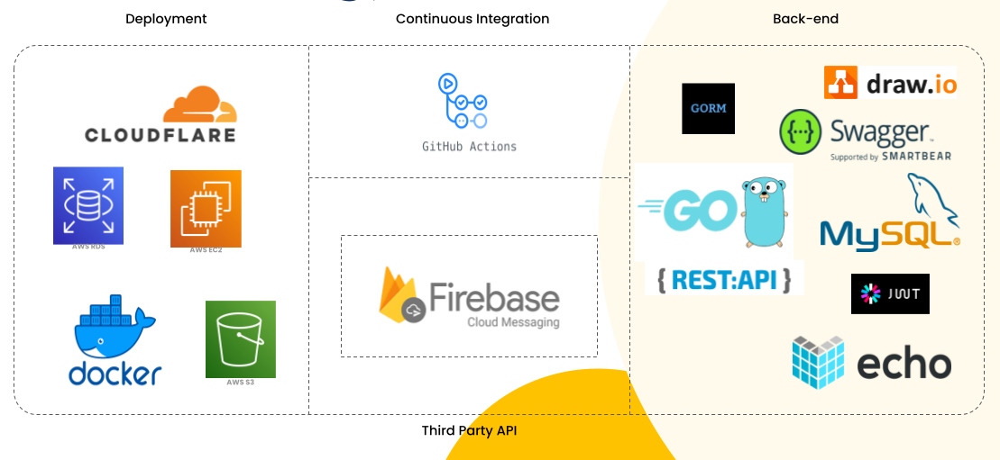
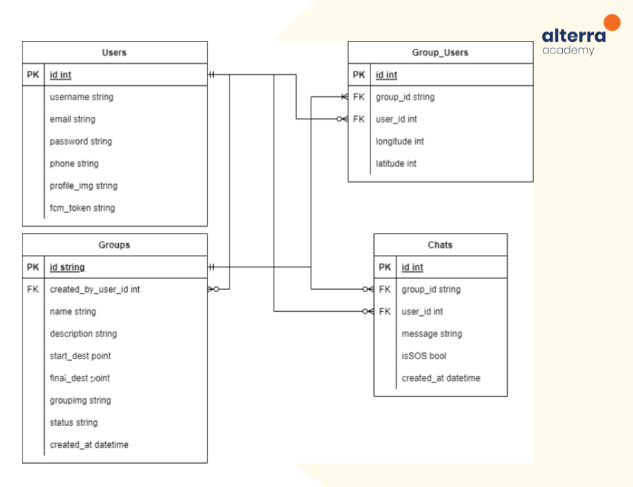

# LesGoo


<!-- ABOUT THE PROJECT -->

## 🗺️ About The Project 🗺️

LesGoo is a real-time location tracker with a chatting feature. The author's desire to be left behind when traveling inspired the development of this application.

</details>   
       
### 🛣️ &nbsp;Build App & Database 🛣️



## 🏎️ ERD 📍



## Run Locally

Clone the project

```bash
  git clone https://github.com/dh-atha/LesGooBackend
```

Go to the project directory

```bash
  cd LesGooBackend
```

## Open Api 🔥

If you're interested in using our Open Api, this is an example of how to do so.

Final Project Capstone Program Immersive Alterra Academy
<br />
<a href="https://app.swaggerhub.com/apis-docs/faqihassyfa/LesGoo/1.0.0"><strong>Go to Open API »</strong></a>
<br />
<div>
      <details>
<summary>👶 Users</summary>
  
  <!---
  | Command | Description |
| --- | --- |
  --->
  
This is an explanation of the Users section's CRUD method.
 
<div>
  
| Feature User | Endpoint | Param | JWT Token | Function |
| --- | --- | --- | --- | --- |
| POST | /login  | - | NO | This is how users log in.  |
| POST | /logout | - | YES | This is how users log out. |
| POST | /register | - | NO | This is how users register their account. |
| GET | /users | - | YES | Users obtain their account information in this form. |
| PUT | /users | - | YES | This is how users Update their profile. |
| DELETE | /users | - | YES | This is how users Delete their profile. |

</details>

<div>
      <details>
<summary>🏘️ Groups</summary>
  
  <!---
  | Command | Description |
| --- | --- |
  --->
  
Several commands make use of Groups features, as shown below.
 
<div>
  
| Feature Groups | Endpoint | Param | JWT Token | Function |
| --- | --- | --- | --- | --- |
| POST | /group  | - | YES | Create a new Groups. |
| POST | /group/join | - | YES | Join Groups. |
| POST | /group/leave | - | YES | leave current Groups. |
| POST | /group/chats | - | YES | Get all Chat and participant location. |
| GET | /group/{id} | ID Groups | YES | Displaying Group detail by id. |
| DELETE| /group/{id} | ID Groups | YES | Delete Groups. |

</details>

<div>
      <details>
<summary>💬 Chats</summary>
  
  <!---
  | Command | Description |
| --- | --- |
  --->
  
Several commands make use of Chats features, as shown below.
 
<div>
  
| Feature Chats | Endpoint | Param | JWT Token | Function |
| --- | --- | --- | --- | --- |
| POST | /chats  | - | YES | Send a message to the groups. |

</details>

<div>
      <details>
<summary>⚓ Locations</summary>
  
  <!---
  | Command | Description |
| --- | --- |
  --->
  
Several commands make use of Locations features, as shown below.
 
<div>
  
| Feature Locations | Endpoint | Param | JWT Token | Function |
| --- | --- | --- | --- | --- |
| POST | /locations  | - | YES | Get location. |

</details>

## Authors 👑

-   Faza Muttaqien  [](https://github.com/faza-muttaqien)

-  Atha Dhaiffathin [](https://github.com/dh-atha)

-   Faqih Assyfa Poedjiono  [](https://github.com/faqihassyfa)

 <p align="right">(<a href="#top">back to top</a>)</p>
<h3>
<p align="center">:copyright: August 2022 </p>
</h3>
<!-- end -->
<!-- comment -->
